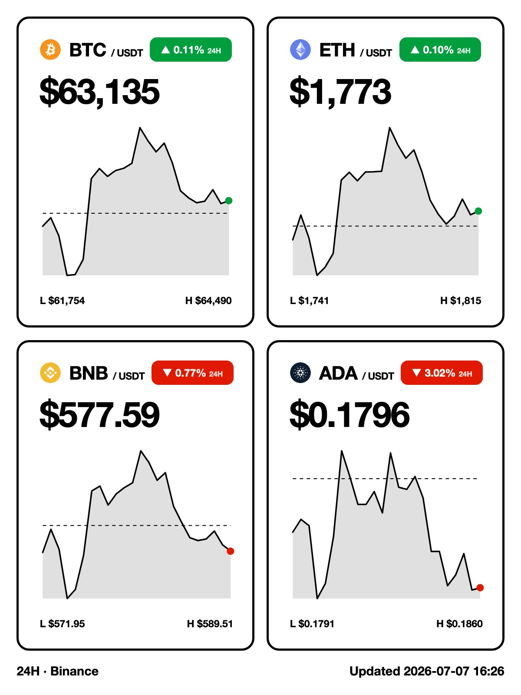
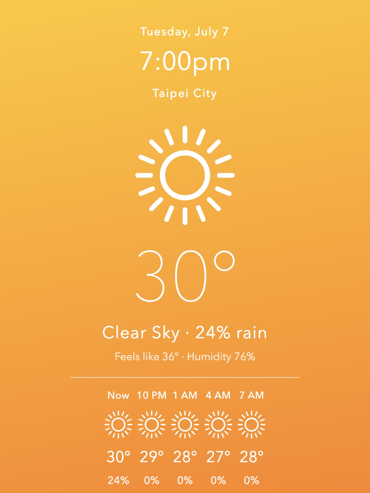

# Bloomin8 Canvas — LAN Control + Claude Code Skill

> Controls a Bloomin8 colour e-ink frame directly over the LAN. **Device-to-device — no cloud, no auth.**

This repo has two ways in, and neither has a hard dependency on the other:

1. **As a [Claude Code](https://claude.com/claude-code) Agent Skill** — drive the frame with natural language (push images, manage galleries/playlists, render live dashboards) through Claude Code's Skill mechanism. See [Using it with Claude Code](#using-it-with-claude-code) below.
2. **As plain Python/shell scripts** — every operation is a self-contained `uv run` script or `curl` call with no LLM involved, so you can wire it into cron, systemd, Home Assistant, or anything else that can run a shell command. See **[docs/scripting.md](docs/scripting.md)**.

Device operations are centralized in a reusable Python client (`skills/bloomin8-canvas/scripts/client.py`) that both paths use identically. The cloud `einkshot.run.app` API is intentionally not used — everything here is device-to-device.

> ⚠️ **Work in progress / personal project.** Validated on firmware `1.8.35` (EL133UF1, 1200×1600). Other firmware versions or models may behave differently — use at your own discretion.

## Requirements

- The machine and the Canvas on the same LAN segment (no VLAN isolation).
- [`uv`](https://docs.astral.sh/uv/) — all scripts pull their Python dependencies through it at runtime.
- **Bluetooth on the machine, within ~10 m of the Canvas** — required for auto-wake. The frame sleeps aggressively and drops off the network entirely; `wake.py` wakes it with a BLE pulse before any operation. Without Bluetooth you can still control the frame while it is awake, but you'll have to wake it via the Bloomin8 mobile app, or extend `max_idle` / the sleep schedule via device settings so it stays reachable when your cron fires.

## Configuration

The skill and `wake.py` read the target device from environment variables:

| Variable | Required | Description |
|----------|----------|-------------|
| `BLOOMIN8_LAN_IP` | ✅ | The frame's LAN IP, e.g. `192.168.0.87` |
| `BLOOMIN8_BLE_NAME` | — | Device name used for BLE scan matching, defaults to `Bloomin8` |
| `BLOOMIN8_BLE_MAC` | — | Explicit BLE MAC (works on Linux/Windows; macOS hides hardware MACs, so name matching is used instead) |

> Environment variables must be visible to non-interactive zsh. Put them in `~/.zshrc` and `source ~/.zshrc` at the start of any session that needs them.

```bash
# ~/.zshrc
export BLOOMIN8_LAN_IP=192.168.0.87
export BLOOMIN8_BLE_NAME=Bloomin8
```

Verify connectivity:

```bash
curl -sS --max-time 3 "http://$BLOOMIN8_LAN_IP/deviceInfo" >/dev/null \
  && echo OK || echo "asleep — BLE wake needed"
```

## What's Inside

One skill, **[bloomin8-canvas](skills/bloomin8-canvas/SKILL.md)**, organized by task:

- **Device control** (`SKILL.md`) — status queries, image push, single/gallery/playlist playback, gallery and playlist CRUD, `sleep` / `reboot` / `clearScreen` / `settings`, plus BLE wake recovery when the device is asleep. All operations go through `scripts/client.py`, a reusable Python client (CLI or module) that bakes in the firmware gotchas: wake-then-poll, fresh-filename uploads, Ready polling, display verification.
- **Crypto price dashboard** (`references/crypto-dashboard.md`) — render a BTC/ETH (or any Binance symbol) price + sparkline dashboard as a JPEG sized to the frame's resolution and push it to the Canvas. Portrait and landscape layouts, e-ink-optimized template (pure black/white + saturated red/green), cron-friendly for scheduled refreshes.
- **Countdown / day counter** (`references/countdown.md`) — days until (or since) a date, in elegant serif type over a public-domain painting fetched from the Met Museum API; the artwork rotates daily and is cached for offline runs, or pass your own photo.
- **Weather dashboard** (`references/weather.md`) — current temperature, condition, and rain probability up top, plus a 3-hourly forecast strip anchored at the current hour; data from Open-Meteo (no key), bold SVG icons tuned for e-ink.

  ```bash
  # one-time: uv run --with playwright playwright install chromium
  uv run skills/bloomin8-canvas/scripts/render.py --symbols BTC,ETH,BNB,ADA --out /tmp/crypto.jpg
  uv run skills/bloomin8-canvas/scripts/client.py upload /tmp/crypto.jpg --prefix crypto
  ```

### Demos

All rendered at the panel's native 1200×1600; landscape layouts are also supported per dashboard.

| Crypto | Weather | Countdown |
|:---:|:---:|:---:|
|  |  |  |
| `render.py --symbols BTC,ETH,BNB,ADA` | `weather.py --city "Taipei City"` | `countdown.py --date 2026-12-31 --title "New Year's Eve"` |

## Using it with Claude Code

### Installation

Install with the [`skills`](https://github.com/vercel-labs/skills) CLI:

```bash
npx skills add Dopiz/bloomin8-canvas-skills
```

This clones the repo, detects `skills/bloomin8-canvas/SKILL.md`, and copies the skill (including `wake.py`, `scripts/`, `references/`, and `assets/`) into Claude Code's skills directory at `~/.claude/skills/bloomin8-canvas`. The scripts pull their dependencies (`bleak`, `requests`, `playwright`, `pillow`) on the fly through `uv` at runtime — no extra packages to install.

Verify BLE wake works (requires `uv`):

```bash
uv run --with bleak python ~/.claude/skills/bloomin8-canvas/wake.py
```

After that, the skill triggers automatically whenever you mention Bloomin8 / Canvas / the e-ink frame, or ask to push an image, manage galleries, or check status in a Claude Code conversation.

### Usage

Once triggered, the skill is driven with natural language, for example:

- "What's the status of my bloomin8 frame?"
- "Push this image to the frame."
- "Create a vacation gallery, upload these photos, and start a slideshow."
- "Put the frame to sleep / reboot it."
- "Show BTC, ETH, BNB and ADA prices on the frame."
- "Refresh the crypto dashboard on the canvas with the 7-day trend, landscape layout."
- "Switch the frame to a countdown for our wedding on June 15, 2026."
- "Show today's weather for Taipei on the frame."

Claude reads [SKILL.md](skills/bloomin8-canvas/SKILL.md) and the task-specific files under `references/` to pick the right script and flags — you don't need to know the underlying commands.

## Using it without AI

No part of this repo requires an LLM at runtime — the skill is a documentation/routing layer on top of plain scripts. If you want to drive the frame from cron, systemd, Home Assistant, or your own code instead of Claude Code, see **[docs/scripting.md](docs/scripting.md)** for the full command reference. Short version:

```bash
uv run skills/bloomin8-canvas/scripts/weather.py --city Taipei --out /tmp/weather.jpg
uv run skills/bloomin8-canvas/scripts/client.py upload /tmp/weather.jpg --prefix weather
```

## How It Works

- **LAN-direct**: the frame exposes an unauthenticated HTTP API on the local network; pushing content is device-to-device with **no cloud involvement**.
- **Aggressive sleep**: the e-ink frame sleeps frequently, so HTTP times out. When that happens `wake.py` sends a BLE wake pulse (GATT write to `0000f001-…`, `0x01` → hold 500ms → `0x00`); HTTP usually responds again within 1–3 seconds. The 500ms hold mimics a real button press and wakes firmware 1.8.35 reliably.
- **Stay awake**: after waking, the device stays reachable for about `max_idle` seconds (see `/deviceInfo`); for a sequence of operations, `GET /whistle` periodically to keep it from dozing off.
- **Fresh filenames only**: the firmware caches the processed image by file path — uploading new content under an existing filename shows the stale image (even after deleting it first) while `/state` still reports success. `client.py` handles this by timestamping every upload and verifying `/deviceInfo.image` afterwards.

## Troubleshooting

| Symptom | Fix |
|---------|-----|
| HTTP timeout | Device is asleep → run `wake.py` for a BLE wake; don't blindly retry-loop |
| BLE can't find the device | Make sure the Mac is within ~10 m; first run needs Bluetooth permission for the terminal (System Settings → Privacy & Security → Bluetooth) |
| Distorted image | `/upload` accepts JPEG only and the image must be pre-resized to `/deviceInfo`'s `width × height` |
| Screen shows old content after upload | Filename was reused — the firmware serves the cached processed image. Upload under a fresh name (or use `client.py upload`, which does this automatically) |
| Anyone can control it | The API has no bearer auth — keep it off untrusted networks |

## Reference

Official API documentation: <https://bloomin8.readme.io/>

## License

Personal project, no warranty of any kind. Use only on devices you own and on trusted networks.
